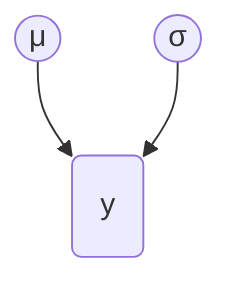

# An Introduction to Probability and Computational Bayesian Statistics

In Bayesian statistics,
we often say that we are "sampling" from a posterior distribution
to estimate what parameters could be,
given a model structure and data.
What exactly is happening here?

Examples that I have seen on "how sampling happens"
tends to focus on an overly-simple example
of sampling from a single distribution with known parameters.
I was wondering if I could challenge myself
to come up with a "simplest complex example"
that would illuminate ideas that were obscure to me before.
In this essay, I would like to share that knowledge with you,
and hopefully build up your intuition behind
what is happening in computational Bayesian inference.

## Probability Distributions

We do need to have a working understanding
of what a probability distribution is before we can go on.
Without going down deep technical and philosophical rabbit holes
(I hear they are deep),
I'll start by proposing
that "a probability distribution is a Python object
that has a math function
that allocates credibility points onto the number line".

Because we'll be using the normal distribution extensively in this essay,
we'll start off by examining that definition
in the context of the standard normal distribution.

### Base Object Implementation

Since the normal distribution is an object,
I'm implying here that it can hold state.
What might that state be?
Well, we know from math that probability distributions have parameters,
and that the normal distribution
has the "mean" and "variance" parameters defined.
In Python code, we might write it as:

```python
class Normal:
    def __init__(self, mu, sigma):
        self.mu = mu
        self.sigma = sigma
```

### Probability Density Function

Now, I also stated that the normal distribution has a math function
that we can use to allocate credibility points to the number line.
This function also has a name,
called a "probability density function", or the "PDF".
Using this, we may then extend extend this object
with a method called `.pdf(x)`,
that returns a number
giving the number of credibility points
assigned to the value of `x` passed in.

```python
import numpy as np

class Normal:
    def __init__(self, mu, sigma):
        self.mu = mu
        self.sigma = sigma

    def pdf(self, x):
        return (
            1 / np.sqrt(2 * self.sigma ** 2 * np.pi)
            * np.exp(
                - (x - self.mu) ** 2
                / 2 * self.sigma ** 2
            ))
```

If we pass in a number `x` from the number line,
we will get back another number that tells us
the number of credibility points given to that value `x`,
under the state of the normal distribution instantiated.
We'll call this $P(x)$.

To simplify the implementation used here,
we are going to borrow some machinery already available to us
in the Python scientific computing ecosystem,
particularly from the SciPy stats module,
which gives us reference implementations of probability distributions.

```python
from scipy.stats import norm

class Normal:
    def __init__(self, mu, sigma):
        self.mu = mu
        self.sigma = sigma

        # We instantiate the distribution object here.
        self.dist = norm(loc=mu, scale=sigma)

    def pdf(self, x):
        # Now, our PDF class method is simplified to be just a wrapper.
        return self.dist.pdf(x)
```

### Log Probability

A common task in Bayesian inference is computing the likelihood of data.
Let's assume that the data ${X_1, X_2, ... X_i}$ generated
are independent and identically distributed,
(the famous _i.i.d._ term comes from this).
This means, then, that the joint probability of the data that was generated
is equivalent to the product of the individual probabilities of each datum:

$$P(X_1, X_2, ... X_i) = P(X_1) P(X_2) ... P(X_i)$$

(We have to know the rules of probability to know this result;
it is a topic for a different essay.)

If you remember the notation above,
each $P(X_i)$ is an evaluation of $X_i$
on the distribution's probability density function.
It being a probability value means it is bound between 0 and 1.
However, multiplying many probabilities together
usually will result in issues with underflow computationally,
so in evaluating likelihoods,
we usually stick with log-likelihoods instead.
By the usual rules of math, then:

$$\log P(X_1, X_2, ..., X_i) = \sum_{j=1}^{i}\log P(X_i)$$

To our normal distribution class,
we can now add in another class method
that computes the sum of log likelihoods
evaluated at a bunch of i.i.d. data points.

```python
from scipy.stats import norm

class Normal:
    def __init__(self, mu, sigma):
        self.mu = mu
        self.sigma = sigma

        # We instantiate the distribution object here.
        self.dist = norm(loc=mu, scale=sigma)

    def pdf(self, x):
        # Now, our PDF class method is simplified to be just a wrapper.
        return self.dist.pdf(x)

    def logpdf(self, x):
        return self.dist.logpdf(x)
```

## Random Variables

### Definition

Informally, a "random variable" is nothing more than
a variable whose quantity is non-deterministic (hence random)
but whose probability of taking on a certain value
can be described by a probability distribution.

According to the Wikipedia definition of a [random variable][rv]:

> A random variable has a probability distribution, which specifies the probability of its values.

[rv]: https://en.wikipedia.org/wiki/Random_variable

As such, it may be tempting to conceive of a random variable
as an object that has a probability distribution attribute attached to it.

### Realizations of a Random Variable

On the other hand, it can also be convenient to invert that relationship,
and claim that a probability distribution
can generate realizations of a random variable.
The latter is exactly how SciPy distributions are implemented:

```python
from scipy.stats import norm

# Normal distribution can generate realizations of an RV
# The following returns a NumPy array of 10 draws
# from a standard normal distribution.
norm(loc=0, scale=1).rvs(10)
```

??? note "Realizations of a Random Variable"

    A "realization" of a random variable is nothing more than
    generating a random number
    whose probability of being generated
    is defined by the random variable's probability density function.

Because the generation of realizations of a random variable
is equivalent to sampling from a probability distribution,
we can extend our probability distribution definition
to include a `.sample(n)` method:

```python
from scipy.stats import norm

class Normal:
    def __init__(self, mu, sigma):
        self.mu = mu
        self.sigma = sigma

        # We instantiate the distribution object here.
        self.dist = norm(loc=mu, scale=sigma)

    # ...

    def sample(self, n):
        return self.dist.rvs(n)
```

Now, if we draw 10 realizations of a normally distributed random variable,
and the drawing of each realization has no dependence of any kind
on the previous draw,
then we can claim that each draw is **independent**
and **identically distributed**.
This is where the fabled "_iid_" term in undergraduate statistics classes
comes from.

## Data Generating Process

Now that we have covered what probability distributions are,
we can now move on to other concepts
that are important in Bayesian statistical modelling.

Realizations of a random variable,
or draws from its probability distribution,
are how a Bayesian assumes data are generated.
Describing how data are generated using probability distributions,
or in other words, writing down the "data generating process",
is a core activity in Bayesian statistical modelling.

Viewed this way, data values generated by a random process
depend on the underlying random variable's probability distribution.
In other words, the random variable realizations are known,
given the probability distribution used to model it.
Keep this idea in mind:
it is going to be important shortly.

## Bayes' Rule

Now that we've covered probability distributions,
we can move on to Bayes' rule.
You probably have seen the following equation:

$$P(B|A) = \frac{P(A|B)P(B)}{P(A)}$$

Bayes' rule states nothing more than the fact that
the conditional probability of B given A is equal to
the conditional probability of A given B
times the probability of B
divided by the probability of A.

When doing Bayesian statistical inference,
we commonly take a related but distinct interpretation:

$$P(H|D) = \frac{P(D|H)P(H)}{P(D)}$$

It may look weird,
but didn't we say before that data are realizations from a random variable?
Why are we now treating data as a random variable?
Here, we are doing not-so-intuitive but technically correct step
of treating the data $D$ as being part of this probabilistic model
(hence it "looks" like a random variable),
alongside our model parameters $H$.
There's a lot of measure theory that goes into this interpretation,
which at this point I have not yet mastered,
and so will wave my hands in great arcs
and propose that this interpretation be accepted for now and move on.

??? note "Data are random variables?"

    Notes from a chat with Colin gave me a lot to chew on, as usual:

    > The answer is in how you define "event" as
    > "an element of a sigma algebra".
    > intuitively, an "event" is just an abstraction,
    > so one event might be "the coin is heads",
    > or in another context the event might be
    > "the parameters are [0.2, 0.1, 0.2]".
    > And so analogously, "the data were configured as [0, 5, 2, 3]".
    > Notice also that the events are different
    > if the data being ordered vs unordered are different!

    This was a logical leap that I had been asked about before,
    but did not previously have the knowledge to respond to.
    Thanks to Colin, I now do.


[colin]: https://colindcarroll.com/

With the data + hypothesis interpretation of Bayes' rule in hand,
the next question arises:
What math happens when we calculate posterior densities?

## Translating Bayes' Math to Python

### Defining Posterior Log-Likelihood

To understand this, let's look at the simplest complex example
that I could think of:
Estimating the $\mu$ and $\sigma$ parameters
of a normal distribution
conditioned on observing data points $y$.

If we assume a data generating process that looks like the following
(with no probability distributions specified yet):



We can write out the following probabilistic model
(now explicitly specifying probability distributions):

$$\mu \sim Normal(0, 10)$$

$$\sigma \sim Exponential(1)$$

$$y \sim Normal(\mu, \sigma)$$

Let's now map the symbols onto Bayes' rule.

- $H$ are the parameters, which are $\mu$ and $\sigma$ here.
- $D$ is the data that I will observe
- $P(H|D)$ is the posterior, which we would like to compute.
- $P(D|H)$ is the likelihood,
and is given by $y$'s probability distribution $Normal(\mu, \sigma)$,
or in probability notation, $P(y|\mu, \sigma)$.
- $P(H)$ is the the prior, and is given by $P(\mu, \sigma)$.
- $P(D)$ is a hard quantity to calculate, so we sort of cheat and don't use it,
and merely claim that the posterior is proportional to likelihood times prior.

If we look at the probability symbols again,
we should notice that $P(\mu, \sigma)$
is the joint distribution between $\mu$ and $\sigma$.
However, from observing the graphical diagram,
we'll notice that $\mu$ and $\sigma$ have no bearing on one another:
we do not need to know $\mu$ to know the value of $\sigma$,
and vice versa.
Hence, they are independent of one another,
and so by the rules of probability,

$$P(\mu, \sigma) = P(\mu | \sigma)P(\sigma) = P(\mu)P(\sigma) = P(H)$$

Now, by simply moving symbols around:

$$P(H|D) = P(D|H)P(H)$$

$$ = P(y|\mu,\sigma)P(\mu, \sigma)$$

$$ = P(y|\mu, \sigma)P(\mu)P(\sigma)$$

This translates directly into Python code!

```python
def model_prob(mu, sigma, y):
    # Probability of mu under prior.
    normal_prior = Normal(0, 10)
    mu_prob = normal_prior.pdf(mu)

    # Probability of sigma under prior.
    sigma_prior = Exponential(1)
    sigma_prob = sigma_prior.pdf(sigma)

    # Likelihood of data given mu and sigma
    likelihood = Normal(mu, sigma)
    likelihood_prob = likelihood.pdf(y).prod()

    # Joint likelihood
    return mu_prob * sigma_prob * likelihood_prob
```

If you remember, multiplying so many probability distributions together
can give us underflow issues when computing,
so it is common to take the log of both sides.

$$\log(P(H|D)) = log(P(y|\mu, \sigma)) + log(P(\mu)) + log(P(\sigma))$$

This also translates directly into Python code!

```python
def model_log_prob(mu, sigma, y):
    # log-probability of mu under prior.
    normal_prior = Normal(0, 10)
    mu_log_prob = normal_prior.logpdf(mu)

    # log-probability of sigma under prior.
    sigma_prior = Exponential(1)
    sigma_log_prob = sigma_prior.logpdf(sigma)

    # log-likelihood given priors and data
    likelihood = Normal(mu, sigma)
    likelihood_log_prob = likelihood.logpdf(y).sum()

    # Joint log-likelihood
    return mu_log_prob + sigma_log_prob + likelihood_log_prob
```

## Computing the Posterior with Sampling

To identify what the values of $\mu$ and $\sigma$
should take on given the data and priors,
we can turn to sampling to help us.
I am intentionally skipping over integrals
which are used to compute expectations,
which is what sampling is replacing.

### Metropolis-Hastings Sampling

An easy-to-understand sampler that we can start with
is the Metropolis-Hastings sampler.
I first learned it in a grad-level computational biology class,
but I expect most statistics undergrads should have
a good working knowledge of the algorithm.

For the rest of us, check out the note below on how the algorithm works.

???+ note "The Metropolis-Hastings Algorithm"

    Shamelessly copied (and modified)
    from the [Wikipedia article]():

    - For each parameter $p$, do the following.
    - Initialize an arbitrary point for the parameter (this is $p_t$, or $p$ at step $t$).
    - Define a probability density $P(p_t)$, for which we will draw new values of the parameters. Here, we will use $P(p) = Normal(p_{t-1}, 1)$.
    - For each iteration:
        - Generate candidate new candidate $p_t$ drawn from $P(p_t)$.
        - Calculate the likelihood of the data under the previous parameter value(s) $p_{t-1}$: $L(p_{t-1})$
        - Calculate the likelihood of the data under the proposed parameter value(s) $p_t$: $L(p_t)$
        - Calculate acceptance ratio $r = \frac{L(p_t)}{L(p_{t-1})}$.
        - Generate a new random number on the unit interval: $s \sim U(0, 1)$.
        - Compare $s$ to $r$.
            - If $s \leq r$, accept $p_t$.
            - If $s \gt r$, reject $p_t$ and continue sampling again with $p_{t-1}$.

[mh]: https://en.wikipedia.org/wiki/Metropolis%E2%80%93Hastings_algorithm

In the algorithm described in the note above,
our parameters $p$ are actually $(\mu, \sigma)$.
This means that we have to propose two numbers
and sample two numbers in each loop of the sampler.

To make things simple for us, let's use the normal distribution
centered on $0$ but with scale $0.1$
to propose values for each.

We can implement the algorithm in Python code:

```python linenums="1"
# Metropolis-Hastings Sampling
mu_prev = np.random.normal()
sigma_prev = np.random.normal()

# Keep a history of the parameter values and ratio.
mu_history = dict()
sigma_history = dict()
ratio_history = dict()

for i in range(1000):
    mu_history[i] = mu_prev
    sigma_history[i] = sigma_prev
    mu_t = np.random.normal(mu_prev, 0.1)
    sigma_t = np.random.normal(sigma_prev, 0.1)

    # Compute joint log likelihood
    LL_t = model_log_prob(mu_t, sigma_t, y)
    LL_prev = model_log_prob(mu_prev, sigma_prev, y)

    # Calculate the difference in log-likelihoods
    # (or a.k.a. ratio of likelihoods)
    diff_log_like = LL_t - LL_prev
    if diff_log_like > 0:
        ratio = 1
    else:
        # We need to exponentiate to get the correct ratio,
        # since all of our calculations were in log-space
        ratio = np.exp(diff_log_like)

    # Defensive programming check
    if np.isinf(ratio) or np.isnan(ratio):
        raise ValueError(f"LL_t: {LL_t}, LL_prev: {LL_prev}")

    # Ratio comparison step
    ratio_history[i] = ratio
    p = np.random.uniform(0, 1)

    if ratio >= p:
        mu_prev = mu_t
        sigma_prev = sigma_t
```

Because of a desire for convenience,
we chose to use a single normal distribution to sample all values.
However, that distribution choice is going to bite us during sampling,
because the values that we could possibly sample for the $\sigma$ parameter
can take on negatives,
but when a negative $\sigma$ is passed
into the normally-distributed likelihood,
we are going to get computation errors!
This is because the scale parameter of a normal distribution
can only be positive, and cannot be negative or zero.
(If it were zero, there would be no randomness.)

### Transformations as a Hack

The key problem here is that the support of the Exponential distribution
is bound to be positive real numbers only.
That said, we can get around this problem
simply by sampling amongst the unbounded real number space $(-\inf, +\inf)$,
and then transforming the number by a math function to be in the bounded space.

One way we can transform numbers from an unbounded space
to a positive-bounded space
is to use the exponential transform:

$$y = e^x$$

For any given value $x$, $y$ will be guaranteed to be positive.

Knowing this, we can modify our sampling code, specifically, what was before:

```python
# Initialize in unconstrained space
sigma_prev_unbounded = np.random.normal(0, 1)
# ...
for i in range(1000):
    # ...
    # Propose in unconstrained space
    sigma_t_unbounded = np.random.normal(sigma_prev_unbounded, 0.1)

    # Transform the sampled values to the constrained space
    sigma_prev = np.exp(sigma_prev_unbounded)
    sigma_t = np.exp(sigma_t_unbounded)

    # ...

    # Pass the transformed values into the log-likelihood calculation
    LL_t = model_log_prob(mu_t, sigma_t, y)
    LL_prev = model_log_prob(mu_prev, sigma_prev, y)

    # ...
```

And _voila_!
If you notice, the key trick here was
to **sample in unbounded space**,
but **evalute log-likelihood in bounded space**.
We call the "unbounded" space the _transformed_ space,
while the "bounded" space is the _original_ or _untransformed_ space.
We have implemented the necessary components
to compute posterior distributions on parameters!

### Samples from Posterior

If we simulate 1000 data points from a $Normal(3, 1)$ distribution,
and pass them into the model log probability function defined above,
then after running the sampler,
we get a chain of values that the sampler has picked out
as maximizing the joint likelihood of the data and the model.
This, by the way, is essentially the simplest version of
Markov Chain Monte Carlo sampling that exists
in modern computational Bayesian statistics.

Let's examine the trace from one run:


Notice how it takes about 200 steps before the trace becomes **stationary**,
that is it becomes a flat trend-line.
If we prune the trace to just the values after the 200th iteration,
we get the following trace:


The samples drawn are an approximation to
the expected values of $\mu$ and $\sigma$
given the data and priors specified.

???+ note "Random Variables and Sampling"

    A piece of wisdom directly quoted from my friend [Colin Carroll][colin],
    who is also a PyMC developer:

    > Random variables are *measures*,
    > and measures are only really defined under an integral sign.
    > *Sampling* is usually defined as the act of generating data
    > according to a certain measure.
    > This is confusing, because we invert this relationship
    > when we do computational statistics:
    > we generate the data,
    > and use that to approximate an integral or expectation.

## Topics We Skipped Over

We intentionally skipped over a number of topics.

One of them was why we used a normal distribution with scale of 0.1
to propose a different value, rather than a different scale.
As it turns out the, scale parameter is a tunable hyperparameter,
and in PyMC3 we do perform tuning as well.
If you want to learn more about how tuning happens,
[Colin][colin] has a [great essay][tuning] on that too.

[tuning]: https://colcarroll.github.io/hmc_tuning_talk/

We also skipped over API design,
as that is a topic I will be exploring in a separate essay.
It will also serve as a tour through the PyMC3 API
as I understand it.

## An Anchoring Thought Framework for Learning Computational Bayes

Having gone through this exercise
has been extremely helpful in deciphering
what goes on behind-the-scenes in PyMC3
(and the in-development PyMC4,
which is built on top of TensorFlow probability).

From digging through everything from scratch,
my thought framework to think about Bayesian modelling
has been updated (pun intended) to the following.

Firstly, we can view a Bayesian model
from the axis of **prior, likelihood, posterior**.
Bayes' rule provides us the equation "glue"
that links those three components together.

Secondly, when doing _computational_ Bayesian statistics,
we should be able to modularly separate **sampling**
from **model definition**.
**Sampling** is computing the posterior distribution of parameters
given the model and data.
**Model definition**, by contrast,
is all about providing the model structure
as well as a function that calculates the joint log likelihood
of the model and data.

In fact, based on the exercise above,
any "sampler" is only concerned with the model log probability
(though some also require the local gradient of the log probability
w.r.t. the parameters to find where to climb next),
and should only be required to accept a **model log probability** function
and a proposed set of initial parameter values,
and return a chain of sampled values.

Finally, I hope the "simplest complex example"
of estimating $\mu$ and $\sigma$ of a normal distribution
helps further your understanding of the math behind Bayesian statistics.

All in all, I hope this essay helps your learning, as writing it did for me!

## Thank you for reading!

If you enjoyed this essay and would like to receive early-bird access to more,
[please support me on Patreon][patreon]!
A coffee a month sent my way gets you _early_ access to my essays
on a private URL exclusively for my supporters
as well as shoutouts on every single essay that I put out.

[patreon]: https://patreon.com/ericmjl

Also, I have a free monthly newsletter that I use as an outlet
to share programming-oriented data science tips and tools.
If you'd like to receive it, sign up on [TinyLetter][tinyletter]!

[tinyletter]: https://tinyletter.com/ericmjl
